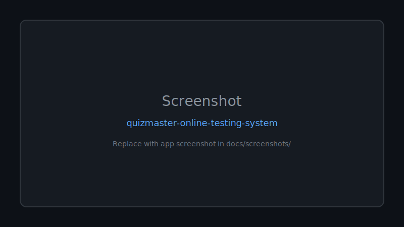
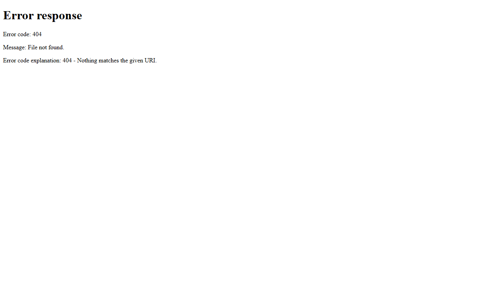

<div align="center">

# 🚀 Quizmaster Online Testing System

**A complete online testing and quiz management system built with Node.js, Express.js, MongoDB, EJS, and MVC architecture featuring authentication, quiz management, analytics, and leaderboard functionality.**

Documented · MIT licensed · Maintained


[](LICENSE)
[](CONTRIBUTING.md)

[Features](#-features) · [Quick Start](#-quick-start) · [Screenshots](#-screenshots) · [Contributing](CONTRIBUTING.md)

</div>

---

## 🖼 Screenshots



*Replace `docs/screenshots/placeholder.svg` with real app screenshots.*

---

## 🐍 Contribution graph


<picture>
  <source media="(prefers-color-scheme: dark)" srcset="https://raw.githubusercontent.com/mafzalkalwardev/quizmaster-online-testing-system/output/snake-dark.svg" />
  <source media="(prefers-color-scheme: light)" srcset="https://raw.githubusercontent.com/mafzalkalwardev/quizmaster-online-testing-system/output/snake.svg" />
  
</picture>


---

## 📚 Project Overview

QuizMaster is a complete **Online Testing System** built with **Node.js, Express.js, MongoDB, and EJS**. It allows admins to create and manage quizzes, and students to attempt quizzes, view results, and compete on leaderboards.

This project is developed as part of a backend development course and follows MVC architecture with RESTful API principles.

---

## 👥 Group Members

- **Muhammad Afzal Kalwar**
- **Ayesha Bibi**
- **Hafsa Kanwal Awan**

---

## ✨ Features

### Admin Features
- ✅ Create, Edit, Delete Quizzes
- ✅ Add, Edit, Delete Questions
- ✅ View all Students
- ✅ View Quiz Attempts
- ✅ View Leaderboard
- ✅ Analytics & Dashboard
- ✅ System Statistics

### Student Features
- ✅ Register & Login
- ✅ Browse Available Quizzes
- ✅ Attempt Quizzes with Timer
- ✅ Submit Answers & View Results
- ✅ View Score & Percentage
- ✅ View Leaderboard
- ✅ Track Previous Attempts
- ✅ View Performance History

---

## 🛠️ Technologies Used

### Core Technologies
- **Node.js** - JavaScript runtime
- **Express.js** - Web framework
- **MongoDB** - NoSQL database
- **Mongoose** - ODM for MongoDB
- **EJS** - Template engine
- **Express-Session** - Session management

### Architecture & Concepts
- **MVC Architecture** - Model-View-Controller pattern
- **RESTful APIs** - REST principles for API design
- **Middleware** - Custom middleware for logging, auth, errors
- **Async/Await** - Asynchronous programming
- **Node.js fs module** - File system operations
- **path module** - Path utilities
- **events module** - Event emitter pattern
- **MongoDB Aggregation Pipeline** - Advanced queries
- **Error Handling Middleware** - Centralized error management

### NOT Used (As Per Requirements)
- ❌ React, Angular, Next.js
- ❌ TypeScript
- ❌ JWT Authentication
- ❌ Redux
- ❌ Docker
- ❌ Redis
- ❌ Socket.io
- ❌ GraphQL

---

## 📁 Project Structure

```
quizmaster/
│
├── config/
│   └── db.js                    # MongoDB connection configuration
│
├── models/
│   ├── User.js                  # User schema (admin/student)
│   ├── Quiz.js                  # Quiz schema
│   ├── Question.js              # Question schema
│   ├── Attempt.js               # Quiz attempt schema
│   └── Result.js                # Quiz result schema
│
├── controllers/
│   ├── authController.js        # Authentication logic
│   ├── quizController.js        # Quiz CRUD operations
│   ├── questionController.js    # Question management
│   ├── attemptController.js     # Quiz attempts & results
│   └── adminController.js       # Admin operations
│
├── routes/
│   ├── authRoutes.js            # Auth endpoints
│   ├── quizRoutes.js            # Quiz endpoints
│   ├── questionRoutes.js        # Question endpoints
│   ├── attemptRoutes.js         # Attempt endpoints
│   └── adminRoutes.js           # Admin endpoints
│
├── middleware/
│   ├── loggerMiddleware.js      # Request logging
│   ├── errorMiddleware.js       # Error handling
│   └── authMiddleware.js        # Authentication guards
│
├── views/
│   ├── index.ejs                # Home page
│   ├── login.ejs                # Login page
│   ├── register.ejs             # Registration page
│   ├── dashboard.ejs            # Student dashboard
│   ├── quizzes.ejs              # Quizzes list
│   ├── quizDetails.ejs          # Quiz details
│   ├── attemptQuiz.ejs          # Quiz attempt page
│   ├── result.ejs               # Result page
│   ├── leaderboard.ejs          # Leaderboard page
│   ├── studentResults.ejs       # Student results
│   ├── myAttempts.ejs           # Student attempts
│   ├── error.ejs                # Error page
│   └── admin/
│       ├── adminDashboard.ejs   # Admin dashboard
│       ├── adminQuizzes.ejs     # Manage quizzes
│       ├── addQuiz.ejs          # Add quiz form
│       ├── editQuiz.ejs         # Edit quiz form
│       ├── manageUsers.ejs      # Manage students
│       ├── manageQuestions.ejs  # Manage questions
│       ├── addQuestion.ejs      # Add question form
│       ├── editQuestion.ejs     # Edit question form
│       ├── quizAttempts.ejs     # Quiz attempts view
│       └── analytics.ejs        # Analytics dashboard
│
├── public/
│   ├── css/
│   │   └── style.css            # Main stylesheet
│   ├── js/
│   │   ├── main.js              # Main client-side JS
│   │   └── quiz-timer.js        # Quiz timer functionality
│   └── images/
│
├── data/
│   └── logs.txt                 # Request logs
│
├── app.js                       # Main application file
├── package.json                 # Dependencies & metadata
└── README.md                    # This file
```

---

## 📊 Database Design

### User Schema
```javascript
{
  name: String,
  email: String (unique),
  password: String,
  role: String ("admin" | "student"),
  createdAt: Date
}
```

### Quiz Schema
```javascript
{
  title: String,
  category: String,
  difficulty: String ("Easy" | "Medium" | "Hard"),
  totalMarks: Number,
  timeLimit: Number (minutes),
  createdBy: ObjectId (User),
  createdAt: Date
}
```

### Question Schema
```javascript
{
  quizId: ObjectId (Quiz),
  questionText: String,
  optionA: String,
  optionB: String,
  optionC: String,
  optionD: String,
  correctAnswer: String ("A" | "B" | "C" | "D"),
  marks: Number
}
```

### Attempt Schema
```javascript
{
  studentId: ObjectId (User),
  quizId: ObjectId (Quiz),
  answers: Map (questionId -> answer),
  score: Number,
  totalQuestions: Number,
  attemptedAt: Date
}
```

### Result Schema
```javascript
{
  studentName: String,
  quizTitle: String,
  score: Number,
  totalMarks: Number,
  percentage: Number,
  submittedAt: Date,
  studentId: ObjectId (User),
  quizId: ObjectId (Quiz)
}
```

---

## 🚀 Installation & Setup

### Prerequisites
- **Node.js** (v14 or higher)
- **MongoDB** (running on localhost:27017)
- **npm** package manager

### Step 1: Install Dependencies
```bash
cd quizmaster
npm install
```

This installs:
- `express` - Web framework
- `mongoose` - MongoDB ODM
- `ejs` - Template engine
- `express-session` - Session management
- `nodemon` - Development tool (auto-restart)

### Step 2: Setup MongoDB
Ensure MongoDB is running:
```bash
# On Windows
mongod

# On macOS/Linux
brew services start mongodb-community
```

Create the database:
```javascript
// Connect to MongoDB and it will create database automatically
// Database: quizmasterDB
// Connection: mongodb://127.0.0.1:27017/quizmasterDB
```

### Step 3: Run Application

**Development Mode (with auto-reload):**
```bash
npm run dev
```

**Production Mode:**
```bash
npm start
```

### Step 4: Access Application
- **URL:** http://localhost:3000
- **Home Page:** http://localhost:3000/

---

## 📝 API Endpoints

### Authentication
- `GET /register` - Registration page
- `POST /register` - Register new student
- `GET /login` - Login page
- `POST /login` - Login user
- `GET /logout` - Logout user

### Quizzes
- `GET /quizzes` - Get all quizzes
- `GET /quizzes/:id` - Get quiz details
- `GET /quizzes/admin/create` - Create quiz page
- `POST /quizzes/admin/create` - Create quiz
- `GET /quizzes/admin/:id/edit` - Edit quiz page
- `PUT /quizzes/admin/:id/edit` - Update quiz
- `DELETE /quizzes/admin/:id/delete` - Delete quiz

### Questions
- `GET /questions/quiz/:quizId/questions` - List questions
- `GET /questions/quiz/:quizId/add` - Add question page
- `POST /questions/quiz/:quizId/add` - Create question
- `GET /questions/quiz/:quizId/:questionId/edit` - Edit question page
- `PUT /questions/quiz/:quizId/:questionId/edit` - Update question
- `DELETE /questions/quiz/:quizId/:questionId/delete` - Delete question

### Quiz Attempts
- `GET /quiz/:quizId/start` - Start quiz
- `POST /quiz/:quizId/submit` - Submit quiz
- `GET /result/:resultId` - View result
- `GET /my-attempts` - View attempts
- `GET /my-results` - View results

### Admin
- `GET /admin/dashboard` - Admin dashboard
- `GET /admin/quizzes` - Manage quizzes
- `GET /admin/students` - Manage students
- `GET /admin/leaderboard` - View leaderboard
- `GET /admin/analytics` - View analytics
- `GET /admin/quiz/:quizId/attempts` - Quiz attempts

---

## 🔐 Authentication & Authorization

### Simple Session-Based Authentication
- Uses `express-session` for session management
- No JWT tokens (as per requirements)
- User data stored in session after login

### Role-Based Access Control
```javascript
// Admin-only routes
isAdmin middleware checks req.session.role === 'admin'

// Student-only routes
isStudent middleware checks req.session.role === 'student'

// Protected routes
isAuthenticated middleware checks req.session.userId exists
```

### Login Credentials
- **Student Login:** Select "student" role
- **Admin Login:** Select "admin" role
- Password validation: Simple string comparison

---

## 📊 Key Features Implementation

### 1. Quiz Management
- CRUD operations with full validation
- Difficulty levels: Easy, Medium, Hard
- Categories: General Knowledge, Science, Math, etc.
- Time limits and total marks

### 2. Question Management
- Multiple choice questions (A, B, C, D)
- Mark allocation per question
- Automatic validation

### 3. Score Calculation
```javascript
// Score Calculation Formula
percentage = (score / totalMarks) * 100

// Example:
// Obtained: 75 marks
// Total: 100 marks
// Percentage = (75 / 100) * 100 = 75%
```

### 4. Leaderboard (MongoDB Aggregation)
```javascript
// Aggregation Pipeline
db.results.aggregate([
  {
    $group: {
      _id: '$studentName',
      averageScore: { $avg: '$percentage' },
      totalAttempts: { $sum: 1 },
      totalScore: { $sum: '$score' }
    }
  },
  { $sort: { averageScore: -1 } },
  { $limit: 100 }
])
```

### 5. Logging System
- Logs stored in `data/logs.txt`
- Format: `[timestamp] METHOD URL - IP: ipaddress`
- Uses fs module for file operations
- Automatic file creation if not exists

### 6. Error Handling
- Centralized error middleware
- Validation error handling
- Database error handling
- 404 page not found
- Custom error views

### 7. Events
- `userRegistered` - When new user registers
- `userLogin` - When user logs in
- `quizCreated` - When quiz is created
- `quizSubmitted` - When quiz is submitted
- Event logging to console

---

## 🧪 Testing the Application

### Test Accounts
1. **Create a student account:**
   - Go to `/register`
   - Fill in name, email, password
   - Login with student role

2. **Admin account (use default or create):**
   - Login with admin role
   - Access `/admin/dashboard`

### Test Workflow

**As Admin:**
1. Create a quiz (e.g., "Math Quiz")
2. Add questions to the quiz
3. View dashboard statistics

**As Student:**
1. Register and login
2. Browse available quizzes
3. Start a quiz and answer questions
4. Submit and view results
5. Check leaderboard
6. View attempt history

---

## 🛡️ Middleware Explained

### Logger Middleware
```javascript
// Logs all HTTP requests
// File: middleware/loggerMiddleware.js
// Output: data/logs.txt
```

### Error Middleware
```javascript
// Centralized error handling
// File: middleware/errorMiddleware.js
// Handles validation, database, and server errors
```

### Auth Middleware
```javascript
// isAuthenticated - Check if logged in
// isAdmin - Check if admin role
// isStudent - Check if student role
// File: middleware/authMiddleware.js
```

---

## 📝 Sample Data / Dummy Data

### Sample Admin User
```javascript
{
  name: "Admin User",
  email: "admin@quizmaster.com",
  password: "admin123",
  role: "admin"
}
```

### Sample Student User
```javascript
{
  name: "John Doe",
  email: "john@example.com",
  password: "student123",
  role: "student"
}
```

### Sample Quiz
```javascript
{
  title: "General Knowledge Quiz",
  category: "General Knowledge",
  difficulty: "Medium",
  totalMarks: 50,
  timeLimit: 30,
  createdBy: ObjectId("admin"),
  createdAt: "2024-05-10"
}
```

To add sample data, use MongoDB shell or Compass.

---

## 🎨 UI/UX Features

### Design Principles
- Clean, professional interface
- Responsive design (mobile-friendly)
- Intuitive navigation
- Consistent color scheme
- Easy-to-read typography

### Color Scheme
- **Primary:** #3498db (Blue)
- **Secondary:** #2ecc71 (Green)
- **Danger:** #e74c3c (Red)
- **Warning:** #f39c12 (Orange)

### Key UI Components
- Navigation bar (sticky)
- Quiz cards with metadata
- Quiz timer with countdown
- Result cards with scores
- Leaderboard table
- Form validations
- Error/success alerts

---

## 🚨 Error Handling

### Error Pages
- `404 Not Found` - Invalid URL
- `403 Forbidden` - Insufficient permissions
- `500 Server Error` - Server issues

### Validation Errors
- Empty form fields
- Invalid email format
- Password mismatch
- Duplicate email
- Invalid quiz/question ID

### Database Errors
- Connection failures
- Validation errors
- Duplicate key errors
- Invalid object IDs

---

## 📈 Analytics & Reporting

### Admin Analytics Dashboard
- Total students count
- Total quizzes count
- Total attempts count
- Average score percentage
- Top performing students
- Attempts per quiz
- Score distribution

### Report Generation
Uses MongoDB aggregation pipeline:
```javascript
// Example: Average score per quiz
db.results.aggregate([
  { $group: { _id: '$quizTitle', avg: { $avg: '$percentage' } } }
])
```

---

## 🔍 Code Quality

### Best Practices
- ✅ MVC architecture followed
- ✅ Async/await for all database operations
- ✅ Error handling with try/catch
- ✅ Input validation on all routes
- ✅ Session-based authentication
- ✅ Middleware for cross-cutting concerns
- ✅ RESTful API design
- ✅ Comments throughout code
- ✅ Modular file structure
- ✅ Separation of concerns

---

## 📚 Learning Outcomes

This project demonstrates:
- Node.js core modules (fs, path, events)
- Express.js routing and middleware
- MongoDB CRUD operations
- MongoDB aggregation pipeline
- EJS templating engine
- MVC architecture implementation
- RESTful API design
- Session-based authentication
- Error handling patterns
- Async/await programming
- Event-driven programming

---

## 🐛 Troubleshooting

### MongoDB Connection Error
```
Error: Cannot connect to MongoDB
Solution: Ensure MongoDB is running on port 27017
```

### Port Already in Use
```
Error: EADDRINUSE: address already in use :::3000
Solution: Change PORT or kill process using port 3000
```

### Session Not Working
```
Error: Session data not persisting
Solution: Ensure express-session is properly configured
```

### Views Not Rendering
```
Error: Cannot find views
Solution: Check views path in app.js, ensure EJS is set as engine
```

---

## 📞 Support & Contact

For issues or questions:
1. Check the logs in `data/logs.txt`
2. Review console error messages
3. Check browser console for client-side errors
4. Verify MongoDB connection
5. Ensure all dependencies are installed

---

## 📄 License

This project is developed for educational purposes as part of a backend development course.

---

## 🎯 Future Enhancements

- Email notifications
- Password reset functionality
- Question bank with categories
- Question difficulty analysis
- Performance charts and graphs
- Export results to PDF
- Multi-language support
- Two-factor authentication
- API documentation (Swagger)

---

## ✅ Course Requirements Met

✅ Node.js asynchronous programming  
✅ Core Node.js modules (fs, path, events)  
✅ Express.js routing  
✅ EJS templates  
✅ REST APIs  
✅ Middleware & error handling  
✅ MongoDB CRUD & Aggregation  
✅ MVC architecture  
✅ DTO & Guards (role-based)  
✅ Manual implementations (no external auth libs)  

---

**Created for: Backend Development Course**  
**Created by: Muhammad Afzal Kalwar, Ayesha Bibi, Hafsa Kanwal Awan**  
**Date: May 2024**  
**Version: 1.0.0**

## Screenshots



